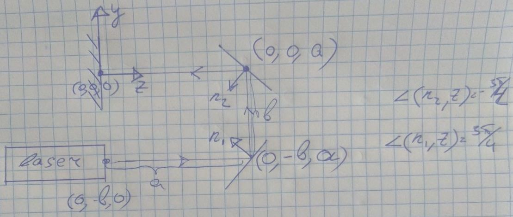

# Laser tuning experiment



## install
```bash
pip3 install -e .
```

## run

```python3
import gym
import laser_env

env = gym.make('laser-v1')
state = env.reset()
state, reward, done, info = env.step()

```
